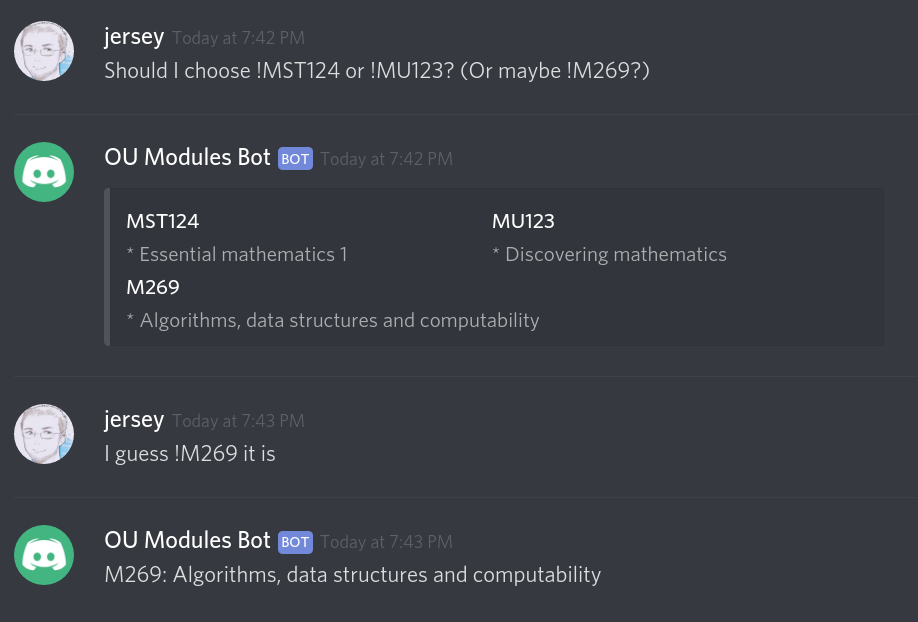

# OU Modules Bot

OU Modules Bot is our Module Codes reference bot, useful in case you ever wonder what are the meanings of module codes which people mention. You can use it with the following types of commands:

 * `!MU123` - will display MU123's title, with a link.
 * `!MST124 !MST125` - will display both MST121 and MST125 titles, with links.
 * `!mst121 !m263 !m366` - old modules and lowercase are fine too! However, we don't provide links to discontinued modules.
 * `!modulename M269` - you can also use the `!modulename` prefix if you want to avoid prefixing module codes with `!`. This will also output an error message if you specify an unknown module code.
 * `!modulename M269 TM351` - the variant with `!modulename` works with multiple modules too.

